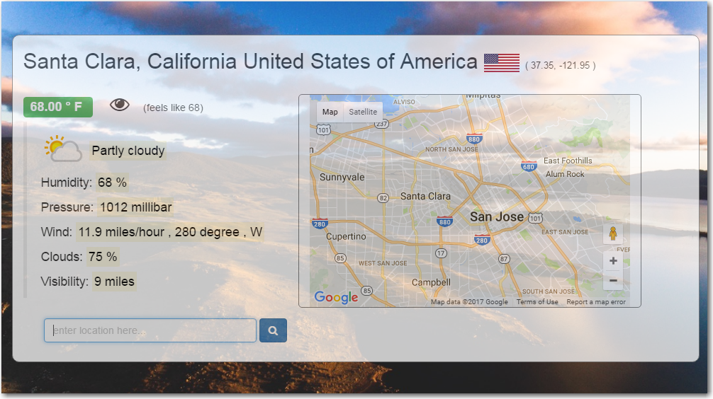

# Introduction

my-weather-card is a simple tool that reports current weather
for any location in the world along with google map, country flag.

By default, it uses your current location.

The background image changes based on reported weather conditions.

Click on the eye symbol to change between C and F.

 
 
Here is the live link https://my-weather-card.herokuapp.com/

## API endpoints
    * Weather: https://api.apixu.com/v1/
    * Map/Locations: https://maps.googleapis.com/maps/api/
    * Geolocation: https://freegeoip.net/json/
    * Country info: https://restcountries.eu/rest/v2/alpha/
